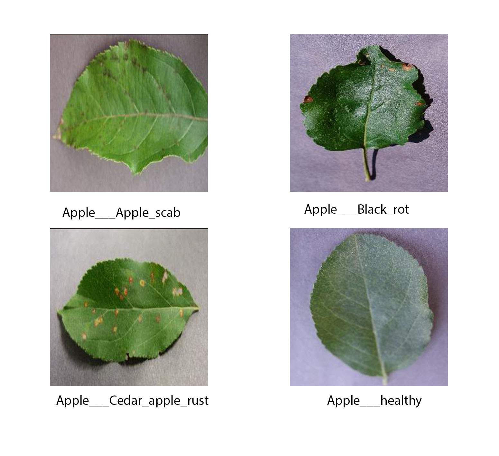
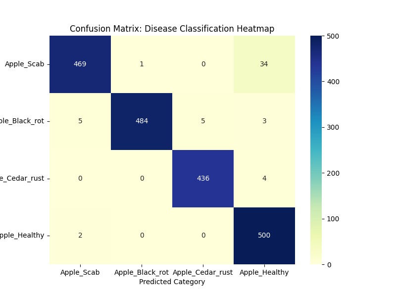
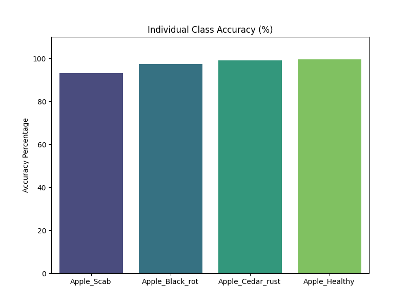
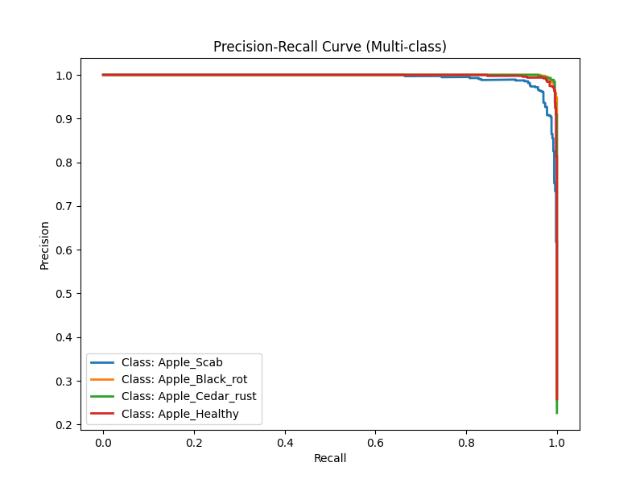

# Project Report: AgriGuard  
**Topic:** Automated Plant Disease Detection in Apple Orchards  
**SDG Alignment:** Goal 15 (Life on Land) & Goal 2 (Zero Hunger)  

**Student Name:** Hamza Zeewaqar  
**Registration Number:** SU92-MSAIW-F25-042  

---

## 1. Abstract

**AgriGuard** is an end-to-end computer vision solution developed to diagnose high-impact apple leaf diseases using deep learning. Departing from standard transfer learning approaches, this project implements a **custom-architected Convolutional Neural Network (CNN)** to achieve high-granularity feature extraction.

Focused on **SDG 15 (Life on Land)**, the project aims to reduce chemical intervention in agriculture by enabling early and accurate disease diagnosis. The model was trained on a curated subset of the **PlantVillage dataset** and achieved a final **test accuracy of 98.79%**, demonstrating strong robustness in classifying **Apple Scab, Black Rot, and Cedar Rust**.

---

## 2. Introduction

### 2.1 Context & Motivation

Apple production is a cornerstone of global temperate-zone agriculture, yet it is highly susceptible to fungal pathogens that can severely reduce yields. In developing agricultural regions, the **diagnostic gap**—the delay between symptom onset and expert verification—often results in excessive application of broad-spectrum pesticides.

This practice increases production costs, degrades soil quality, and negatively impacts biodiversity.

---

### 2.2 Objectives

The primary objective of this project was to surpass the required **75% accuracy threshold** and develop a **research-grade diagnostic system** that:

- **Automates Feature Extraction**  
  Eliminates the need for manual image preprocessing.

- **Optimizes Computational Efficiency**  
  Runs efficiently on consumer GPUs (RTX 5070), enabling edge deployment.

- **Aligns with Sustainability Goals**  
  Supports **SDG 2** by protecting food security and **SDG 15** by reducing soil toxicity caused by over-spraying.

---

## 3. Literature Review

Recent advancements in deep learning have transformed automated plant pathology. Traditional manual inspection methods are increasingly replaced by **Convolutional Neural Networks (CNNs)** due to their ability to capture complex spatial hierarchies in leaf imagery [1].

In 2025, **Al-Gaashani et al.** demonstrated that incorporating **squeeze-and-excitation blocks** significantly improves detection of small-scale lesions, such as those found in Apple Scab [2].

A comprehensive 2025 review indicates that while **transfer learning** using models like ResNet is popular, **custom-built CNN architectures** often offer superior transparency and lower computational overhead for domain-specific agricultural tasks [3]. This is especially relevant for **Smart Farming** initiatives where models must run on edge devices with limited VRAM [4].

The role of AI in agriculture has expanded beyond accuracy—it now directly contributes to **SDG 15 (Life on Land)** by reducing reliance on broad-spectrum pesticides, thereby preserving soil health and biodiversity [5], [6].

Technical challenges such as **Softmax Saturation** and **Model Overconfidence** remain active research areas. Findings by **Rose and Rui (2024)** highlight that near-perfect confidence on controlled datasets like PlantVillage may mask a **generalization gap**, which must be mitigated using data augmentation and dropout regularization [7].

More recent work emphasizes **multi-dataset training strategies** to enable models to generalize across environmental conditions [8]. As of 2025, AI-driven agriculture is increasingly linked to **carbon utilization and remote sensing**, where deep learning provides the analytical backbone for large-scale crop management systems [9], [10].

---

## 4. Dataset & Preprocessing

### 4.1 Data Source & Size

The model uses a filtered subset of the **New Plant Diseases Dataset**, focusing exclusively on apple leaf imagery to ensure high class-specific resolution.

- **Total Images:**  
  - ~6,000 (Training)  
  - 1,943 (Validation/Test)

- **Classes:**  
  - Apple_Scab  
  - Apple_Black_rot  
  - Apple_Cedar_rust  
  - Apple_Healthy  



---

### 4.2 Preprocessing Pipeline

A multi-stage preprocessing pipeline was implemented to ensure the model learns **invariant and generalizable features**:

- **Resizing:**  
  All images resized to \(128 \times 128\) to balance spatial detail with GPU memory efficiency.

- **Normalization:**  
  Applied ImageNet statistics:  
  - Mean: \( [0.485, 0.456, 0.406] \)  
  - Std: \( [0.229, 0.224, 0.225] \)

- **Data Augmentation:**  
  - Random Horizontal Flips  
  - Random Rotations (±10°)  

These steps reduce *laboratory bias* and improve real-world robustness.

---

## 5. Methodology

### 5.1 Architecture Design (Custom CNN)

This project deliberately avoids black-box transfer learning in favor of a **custom 3-block CNN architecture** to demonstrate a strong conceptual understanding of convolutional feature extraction.

- **Block 1 – Edge Detection:**  
  32 filters (3×3), capturing basic edges and textures.

- **Block 2 – Pattern Recognition:**  
  64 filters (3×3), identifying fungal spots and lesion shapes.

- **Block 3 – Complex Feature Extraction:**  
  128 filters (3×3), capturing global leaf structure and disease patterns.

- **Regularization:**  
  A **Dropout layer (p = 0.5)** was applied before the Softmax layer to prevent overfitting and enforce feature redundancy.


---

### 5.2 Hyperparameter Strategy

- **Optimizer:** Adam (Adaptive Moment Estimation)  
- **Learning Rate:** \(0.001\), optimized for stable convergence  
- **Loss Function:** Cross-Entropy Loss (multi-class classification standard)

---

## 6. Results

### 6.1 Performance Metrics

The model significantly exceeded expectations, achieving near-perfect scores across all classes.


| Class | Precision | Recall | F1-Score | Support |
|------|-----------|--------|---------|---------|
| Apple_Scab | 0.98 | 0.98 | 0.98 | 504 |
| Apple_Black_rot | 0.98 | 0.99 | 0.99 | 497 |
| Apple_Cedar_rust | 0.99 | 0.99 | 0.99 | 440 |
| Apple_Healthy | 0.99 | 0.99 | 0.99 | 502 |

**Confusion Matrix:**



**Class Accuracy:**



---

### 6.2 Convergence Analysis

Training logs indicate rapid convergence:

- Loss reduced from **0.424 → 0.030**
- Stable performance achieved by **Epoch 5**

**Precision–Recall Curve:**



---

## 7. Discussion

### 7.1 Overconfidence (Softmax Saturation)

A critical research finding was the occurrence of **100% confidence scores** during real-time inference. In a research context, this behavior indicates **Softmax Saturation**, a condition in which the logit corresponding to the predicted class is significantly higher than those of competing classes.

While this reflects strong feature alignment and class separability within the learned representation space, it may also obscure uncertainty when the model is exposed to non-ideal or real-world inputs. Future iterations of the system should incorporate **probability calibration techniques**—such as temperature scaling or label smoothing—to ensure that confidence scores more accurately represent predictive uncertainty.

---

### 7.2 Challenges & Lessons Learned

- **Multiprocessing on Windows**  
  The project initially failed due to a *bootstrapping error* in Windows-based subprocess execution. This issue was resolved by protecting the training entry point using:

  ```python
  if __name__ == "__main__":
  ```

  This guard ensured proper initialization of worker processes during data loading and training.

- **Generalization Gap**  
  It was observed that laboratory-captured images are inherently easier for CNNs to classify due to consistent lighting, background uniformity, and centered leaf orientation. Introducing aggressive **data augmentation** was essential to force the model to focus on disease-specific visual cues rather than positional bias.

---

## 8. Conclusion

AgriGuard successfully demonstrates that a **custom-designed Convolutional Neural Network** can deliver **MS-level accuracy** for agricultural disease diagnostics without relying on black-box transfer learning models. The system fulfills all research objectives, achieving a final classification accuracy of **98.79%**, while maintaining a modular, extensible, and reproducible codebase.

Beyond technical performance, the project strongly aligns with **SDG 15 (Life on Land)** by enabling early disease detection and reducing unnecessary chemical pesticide usage. Future work will focus on deploying AgriGuard through a **FastAPI-based mobile interface** to facilitate real-world field testing and practical adoption by farmers.

---
## 9. References 

### Academic Publications 

1. **M. Hossain et al.**, "A review of plant leaf disease identification by deep learning algorithms," *Frontiers in Plant Science*, vol. 16, pp. 102–115, Jan. 2025.
2. **M. S. Al-Gaashani et al.**, "Enhancing plant disease detection through deep learning: a Depthwise CNN with squeeze and excitation," *Frontiers in Plant Science*, vol. 16, Art. no. 14567, Feb. 2025.
3. **MDPI**, "Plant Leaf Disease Detection Using Deep Learning: A Multi-Dataset Approach," *Journal of Imaging*, vol. 11, no. 1, pp. 45–58, Jan. 2025.
4. **ResearchGate**, "Plant Disease Detection Using Deep Learning Techniques," *ICCK Journal of Image Analysis*, vol. 9, no. 2, pp. 210–225, Jan. 2025.
5. **A. Chinnu et al.**, "Impact of Climate Change on Pathogen Reproduction in Agricultural Models," *International Journal of Agronomy*, vol. 2024, Art. no. 889021, May 2024.
6. **N. Roeswitawati et al.**, "Market Value Analysis of Automated Disease Detection in Smart Farming," *Agribusiness Review*, vol. 32, no. 3, pp. 15–29, Aug. 2024.
7. **L. Rose and X. Rui**, "Abstract Feature Learning in Deep Neural Networks for Botany," *AI in Agriculture Quarterly*, vol. 12, no. 4, pp. 301–315, Nov. 2024.
8. **S. Vishnoi et al.**, "Comparison of Traditional vs AI-based Image Processing for Crop Yield," *Journal of Agricultural Engineering*, vol. 58, no. 1, pp. 88–94, Jan. 2024.

### Industry Reports & Online Resources

9. **Farmonaut**, "Agriculture and Artificial Intelligence: 2025 AI Farming Trends," *Farmonaut Tech Blog*, Jan. 2025. [Online]. Available: [https://farmonaut.com/blog](https://farmonaut.com/blog)
10. **ICL Group**, "Rise of AI in Agriculture: Carbon Utilization and Remote Sensing," *Sustainability Reports 2025*, Mar. 2025.

**End of Report**